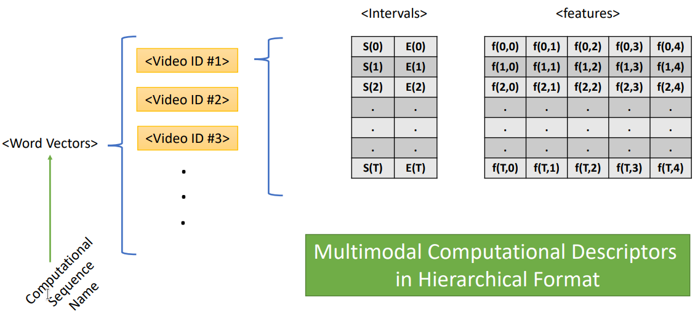

# Arabic-Multimodal-Dataset

Correspondence to:

- Haouhat Abdelhamid: a.haouhat@lagh-univ.dz
- Slimane Belaouar: belaouars@gmail.com
- Attia Nehar: neharattia@univ-djelfa.dz
- Hadda Cherroun: hcherroun@gmail.com

## Paper

[**Towards Arabic Multimodal Dataset for Sentiment Analysis**](https://arxiv.org/abs/xxxx.xxxxxx)<br>
Haouhat Abdelhamid, Slimane Bellaouar, Attia Nehar, Hadda Cherroun<br>

Please cite our paper if you find our work useful for your research:

```tex
@article{xxxx,
  title={Towards Arabic Multimodal Dataset for Sentiment Analysis},
  author={Haouhat Abdelhamid, Slimane Bellaouar, Attia Nehar, Hadda Cherroun},
  journal={arXiv preprint arXiv:xxxx.xxxxx},
  year={2023}
}
```

# Comprehensive Guide and workflow

## Step1: Data Collection

In this step, we will follow specific criteria to select videos that meet the following requirements:

- One Speaker Face per Video: Each video should focus on a single speaker\'s face throughout its duration.

- Clean Arabic Speaking: The selected videos must contain clear and coherent Arabic speech without significant background noise or distortion.

- Balanced Speaker Gender: We aim to include a balanced representation of both male and female speakers in the videos.

- Variety of Topics: We will prioritize selecting videos that cover a wide range of topics to ensure diversity and comprehensiveness.

## Step2: dataset preprocess

### 1) Automatic Speech Recognition (ASR)

To transcribe the Arabic speech in the videos, we can utilize the following two methods:

- [Almufaragh App](https://almufaragh.com/?fbclid=IwAR3udbjb3LwlVUGwMjdUQp18YAStF3W138kWYYiAOGpPOGPhGD1MGfC3jzc) is a Windows application that can be used for Arabic speech recognition.

- [Klaam repository](https://github.com/ARBML/klaam) offers Arabic speech recognition, classification, and text-to-speech capabilities. It employs advanced models such as wave2vec and fastspeech2. You can use the following code snippet to transcribe an Arabic audio file using Klaam:

```
from klaam import SpeechRecognition
model = SpeechRecognition()
model.transcribe(wav_file)
```

### 2) Forced alingment (F2A)

To ensure accurate alignment between each spoken sentence, word, and utterance, we can utilize Aeneas. Aeneas is an automated tool that synchronizes audio and text. It can be used to align the transcript with the corresponding audio in the videos, ensuring precise synchronization.

https://github.com/readbeyond/aeneas

```

python -m aeneas.tools.execute_task "$mp3_file" "$txt_file" "task_language=ar|os_task_file_format=tsv|is_text_type=plain""$tsv_file" --presets-word
```

> Note: you can choose alignment_level in ['UTTERANCE', 'WORD','PHONEME']

### 3) Annotation process

we develope a tool that help us to annotate and segment the videos

## Step3: multimodal feature extraction

### Visual features

```
OpenFace2.2 https://github.com/TadasBaltrusaitis/OpenFace


```

### Acoustic features

Check OpenSmile 3.0 https://www.audeering.com/research/opensmile/

```
./SMILExtract -C ../../../config/emobase/emobase.conf  -I   "$wav_file" -lldcsvoutput  "$csv_file"
```

### Lexical features

```
Please navigate to the "text" directory to access the Python script [BERT_Representation.ipynb] and explore its functionality.

```

python

## Step4: CMU-Multimodal-SDK

In our workflow, we leverage a Python software development kit ([SDK](http://multicomp.cs.cmu.edu/resources/cmu-affect-data-sdk/)) specifically designed to streamline the process of loading and aligning data from various modalities. This SDK serves as a framework that aids us in efficiently loading and aligning multimodal features derived from disparate sources within computational sequence structures. By utilizing this framework, we can effectively manage the integration of different modalities and ensure the seamless alignment of their corresponding features within the computational sequences.

> Note:

### Computational Sequances example



To gain a better understanding, please review the files in the CMU-Multimodal-SDK directory.

# Evalaution

### Prerequisites

- Python 3.7
- CUDA 10.2
- pytorch ==1.8.0
- torchvision == 0.9.0
- fairseq == 0.10.1
- transformers==4.5.1
- pandas == 1.2.5

### training unimodal and multimodal classifiers

In order to facilitate multimodal learning, we employ a cutting-edge model called the Multimodal Transformer (Mult). This model is based on the transformer architecture, a state-of-the-art approach in natural language processing and computer vision. For detailed information and implementation, please refer to the Mult repository available at https://github.com/yaohungt/Multimodal-Transformer. To utilize the Multimodal Transformer, it is recommended to clone the repository and initiate the training process accordingly.

```shell
# move the dataset file to data directory
mkdir data pre_trained_models
# Run traing script
python main.py
```

In other hand, we employ separate LSTM models for each modality, specifically designed for unimodal learning. To access the codebase for these LSTM models, please refer to the unimodal_LSTM.ipynb colab file that contains the necessary code and implementation details to train and utilize the LSTM models for each modality independently.

# Acknowledgement

Thanks to [openface 2.2](https://github.com/TadasBaltrusaitis/OpenFace), [pytorch](https://github.com/pytorch/pytorch),[Hugging Face](https://huggingface.co/docs/transformers/index),[opensmile 3.0](),[Aeneas](https://github.com/readbeyond/aeneas),[Mult](),[CMU-Multimodal-SDK]()
